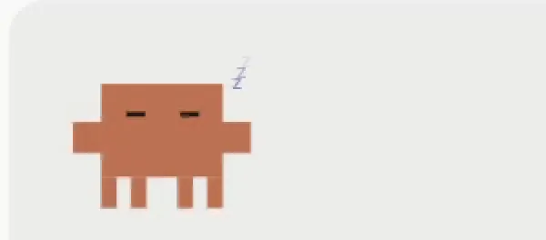
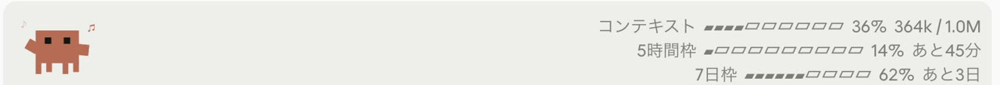
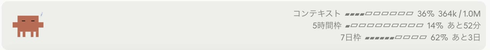
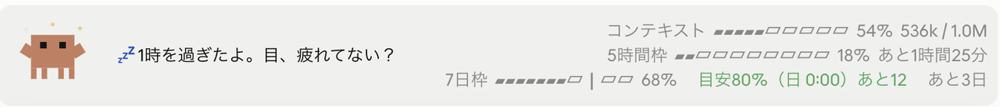
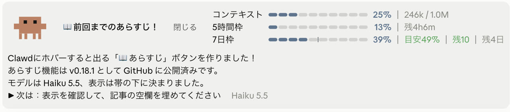
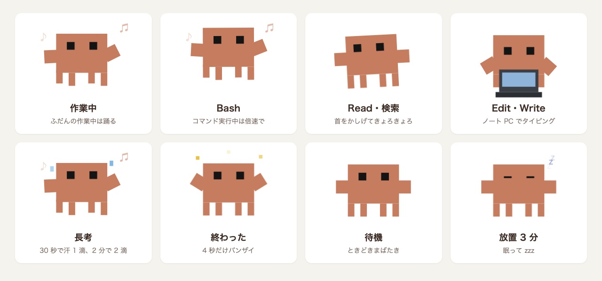

# clawd-dance

Claude Code のデスクトップアプリで、入力欄の上に Clawd が住みつき、Claude の作業に合わせて踊る非公式ファンメイドの mod。

[](https://code.claude.com/docs/en/plugins/mods/overview)
[](https://www.anthropic.com/claude)
[](./LICENSE)

<p align="center">
  
</p>

**Claude Code × Claude Opus 5.5（HIGH）** で作りました。

Claude が考えているあいだ、ただ待つのは少しさみしい。そこで、プロンプトの上の帯に Clawd を置いて、作業の中身に合わせてポーズを変えるようにしました。コマンドを実行すれば激しく踊り、ファイルを読めばきょろきょろし、編集すればノート PC でタイピングします。終わればバンザイ、放っておけば眠ります。帯の右側には、コンテキストの使用率と 5 時間枠・7 日枠の利用状況も出ます。

> [!NOTE]
> 非公式のファンメイド作品です。Clawd は Anthropic の Claude Code のマスコットで、この作品は Anthropic とは関係ありません。

## スクリーンショット

<br>
<sub>作業中。Clawd が踊り、右側に使用量が並びます。80% を超えた行は赤くなります。</sub>

<br>
<sub>待機中。しばらく放っておくと眠ります。</sub>

<br>
<sub>夜ふかしの声かけ。0〜4 時台にメッセージを送ると、Clawd の横に一言が出ます。</sub>

<br>
<sub>前回までのあらすじ。Clawd にマウスを乗せて「📖 あらすじ」を押すと、Haiku がこのセッションの会話をまとめます。</sub>

<p align="center">
  
</p>

上の動画と帯の画像は、実際のアプリの画面を録画・撮影して切り出したものです（動画は Clawd の周りを 2 倍に拡大し、各ポーズの場面をつないでいます）。ポーズの一覧は、mod が描く SVG をそのままブラウザで表示したものです。

## 動き

| 場面 | Clawd |
| --- | --- |
| 作業中 | 踊る |
| Bash の実行中 | 倍速で激しく踊る |
| Read・Grep・Glob・Web 検索・MCP ツール | 首をかしげて、きょろきょろ |
| Edit・Write | ノート PC でタイピング |
| Claude が質問や許可のダイアログを出している | 手を挙げて「?」 |
| 30 秒たった／2 分たった | 汗が 1 滴／2 滴 |
| ターンが終わった直後 | 4 秒だけバンザイ |
| その後 | まばたきしながら待つ |
| 3 分放置 | 眠る（zzz） |
| 本体は区切れたが、裏でバックグラウンドの作業が動いている | きょろきょろして見守る（眠らない） |
| 「前回までのあらすじ」を作っている | きょろきょろ → できたらバンザイ（眠っていても起きる） |

- 一度なったポーズは最低 1.5 秒続きます。Edit のように一瞬で終わる作業でも姿が見えます。
- 15 秒以上かかったターンが終わると、「ピロローン」と効果音を鳴らしてから「終わったよ」と読み上げます（2 分以上なら「おまたせ、終わったよ」）。効果音は音声ファイルを使わずコードで合成し、読み上げには macOS の `say` の日本語音声（Kyoko）を使います。
- 本体の応答が終わっても、裏でサブエージェントやコマンドが動いているときは「終わったよ」とは言わず、「ひと区切りついたよ。バックグラウンドで 3 個動いてるよ」と知らせます。帯には「⏳ バックグラウンド 1/3 完了」と進み具合が出ます。裏の作業が 1 つ終わるたびに本体が通知を処理しても黙っていて、最後の 1 つまで終わったら「バックグラウンドの作業も、ぜんぶ終わったよ」と読み上げてバンザイします。
- Claude が質問のダイアログ（AskUserQuestion）を出すと、効果音のあとに「ちょっと聞きたいことがあるよ」などと読み上げます。席を外していても、返事待ちで止まっていることに気づけます。0〜4 時台は眠そうな音と「夜遅くにごめんね。ひとつ聞きたいことがあるよ」になります。
- 許可のダイアログ（アプリを操作してよいか、コマンドを実行してよいか、計画を進めてよいか など）が出たときも、効果音のあとに「使いたいアプリがあるよ。見てくれる？」「使っていいか、確認したいことがあるよ」などと読み上げます。0〜4 時台は眠そうな音と「夜遅くにごめんね。ひとつ確認させてね」になります。
- 前回までのあらすじ：時間がたって「何をやってたっけ」となったときのために、Clawd にマウスを乗せると「📖 あらすじ」ボタンが出ます。押すと、このセッションの会話を Claude Haiku 5.5 に渡して、「前回までのあらすじ！」として 3 行ほどの要約と「▶ 次は：〜」を帯の下に出します。Haiku 5.5 を使えない環境では、Claude Code の既定の Haiku に切り替えます。どちらが書いたかは、最後の行の右に小さく出ます。「閉じる」を押すか、次にメッセージを送ると消えます。Haiku に渡すのは、あなたの発言と Claude の返答の文だけです（道具の結果は渡さず、「Edit register.tsx」のように道具の名前と対象のファイル名だけにします。長い会話は新しいほうから約 4 万字まで）。押したときに 1 回だけ問い合わせ、その分はあなたの利用枠から使われます。
- 夜ふかしの声かけ：0〜4 時台にメッセージを送ると、Clawd の横に「💤 2時だよ。そろそろ寝よう…」のような一言が出ます。時刻ごとに 3 通りの言葉があり、前回と同じ言葉は続けません。一言は次に送ったとき、または 10 分で消えます。
- その時間帯にターンが終わったときは、「ピロローン」の代わりに「ピポポ…」と小さく下がる眠そうな音を鳴らし、「終わったよ」の代わりにその一言を読み上げます。
- 帯の右側には、コンテキストの使用率とトークン数、5 時間枠・7 日枠の使用率とリセットまでの時間が出ます。使用率は角の丸い 10 区切りの棒で描き、80% を超えると赤になります。右の説明は短く書きます（例：`7日枠 81% │ 目安98% │ 残17 │ 残30h`。リセットまでは 残42m／残4h17m／残30h／残3日）。設定で ▰▱ の文字の棒と今までの書き方にも戻せます。数字はツールの実行後とターンの終わりに更新されます。
- 別の mod [usage-log](https://github.com/tanuu5/usage-log) を一緒に入れていると、7 日枠の行に週間の目安が加わります。例：`7日枠 ▰▰▰▰▰▰┃▰▱▱▱ 67%　目安61%（土 0:00）超過6　あと3日`。`┃`（グラフィカルな棒では縦線）が目安の位置で、超過は赤、余裕は緑です。usage-log が書く `~/.claude/usage-log/pace.json` を読むだけなので、無ければ今までどおりの表示です。

## インストール

**動作環境**：Claude Code のデスクトップアプリ（Code タブ）。mod は公式には Claude Code v2.1.287 以上が必要です。作者は、それより前の早期公開版の mod が入った macOS 版のデスクトップアプリ 2.19675.0（中に入っている Claude Code は 2.1.286）で確かめました。ターミナルの `claude` や VS Code 拡張では帯に何も出ません。

ターミナルで次の 2 行を実行します。

```bash
claude plugin marketplace add tanuu5/clawd-dance
```

```bash
claude plugin install clawd-dance@clawd-dance
```

セッション内で `/plugin marketplace add tanuu5/clawd-dance` と `/plugin install clawd-dance@clawd-dance` を使っても同じです。入れたあと、新しいセッションを開くと帯に Clawd が出ます。外すときは `/plugin` の画面で無効にするか、`claude plugin uninstall clawd-dance@clawd-dance` を実行します。

### 設定を変える

`/config` の画面に、この mod の設定が並びます。

| 設定 | 既定 | 内容 |
| --- | --- | --- |
| 終わったときの音 | 効果音と声 | 効果音と声／効果音だけ／声だけ／鳴らさない |
| 音を鳴らすターンの長さ（秒） | 15 | この秒数以上かかったターンだけ鳴らす |
| 読み上げの声 | Kyoko | macOS の声の名前。入っていない声なら既定の声で読む |
| 待機中も帯を出す | オン | オフにすると、作業中だけ帯を出す |
| バンザイの長さ（秒） | 4 | ターンが終わった直後にバンザイしている時間 |
| 眠るまでの時間（分） | 3 | ターンが終わってから眠るまでの時間 |
| 夜ふかしの声かけ | オン | 0〜4 時台にメッセージを送ると、Clawd が帯でひとこと声をかける |
| 声かけの間隔（分） | 0 | 一度声をかけたら、この時間がたつまで次の声かけをしない（0 なら送るたび） |
| 夜の終わりの音 | 眠そうな音とひとこと | 0〜4 時台のターンの終わりの音。眠そうな音とひとこと／いつもどおり／鳴らさない |
| 使用量の棒の見た目 | グラフィカル | グラフィカル（角の丸い色付きの棒）／テキスト（▰▱ の文字の棒） |
| 質問のときの声かけ | 効果音と声 | Claude が質問のダイアログを出したときに鳴らすもの。効果音と声／効果音だけ／声だけ／鳴らさない |
| 許可のときの声かけ | 効果音と声 | 道具やアプリを使ってよいかのダイアログが出たときに鳴らすもの。効果音と声／効果音だけ／声だけ／鳴らさない |

### この mod がすること・しないこと

mod は Claude Code の中で、あなたの権限のまま動きます。入れる前に中身を確かめてください。

- フックするイベント：`session.start`、`prompt.submit`、`command.run`、`turn.start`、`tool.call`、`turn.complete`、`classic.Stop`、`classic.PermissionRequest`、`classic.Notification`、`ui.render`（帯の `AbovePrompt` だけ）。どれも見るだけで、内容は変えません
- `tool.call` は、どのツールが動いているかを見るだけです。許可・拒否の判断や、ツールへの入力は変えません。
- 使う API：`$.session.usage()`（使用量の取得）、`$.audio.play()`（効果音）、`$.audio.speak()`（読み上げ）、`$.clock`（タイマー）、`$.ui`（描画）、`$.env.get("HOME")` と `$.fs.read()`（`~/.claude/usage-log/pace.json` を読むだけ）、`$.store`（夜ふかしの声かけの、前回の時刻と言葉を覚える）、`$.session.messages()` と `$.model.complete()`（「📖 あらすじ」を押したときだけ、会話を読んで Claude Haiku に要約を頼む）。ほかに、ターンの終わりの Stop イベント（まだ動いているバックグラウンドの作業の一覧を読むだけ）と、メッセージの出どころ（作業の完了通知かどうか）を見ます
- 実行するコマンド：`/bin/date +%z`（夜の時間帯を判定するため、時差を一度だけ聞く）
- 読むファイルは上の 1 つだけです。書き込むのは Claude Code が mod ごとに用意する保存領域（`$.store`）だけです。自分でネットワーク通信はしません。モデルへの問い合わせは「📖 あらすじ」を押したときの 1 回だけで、Claude Code 自身のログインのまま Claude Haiku に送ります（ほかのサービスには送りません）。

## 制作について

企画・ディレクション：**たぬ**　／　開発：**Claude Code（Claude Opus 5.5・推論レベル HIGH）**

mod が発表された翌日に、「Claude が考えているあいだに Clawd を踊らせたい」という思いつきから作りました。Clawd の絵は、以前の作品で描き起こした SVG を元に、最新の Clawd に合わせて脚の位置を直しています。作業中のマーク（スピナー）の差し替えや、返答の末尾に Clawd を添える案も試しました。しかし、デスクトップ版ではスピナーが mod の差し替え対象になっておらず、返答の末尾は文字が届くたびに描き直されて点滅したため、入力欄の上の帯に落ち着きました。踊りは SVG の中の CSS アニメーションだけで動かしています。ポーズごとの絵を最初に全部置いておき、表示・非表示を切り替えることで、切り替えの瞬間に Clawd が消えないようにしています。

## 更新履歴

- **2026-10-02**：公開
- **2026-10-02**（v0.12.0）：usage-log mod があるとき、7 日枠の行に週間の目安を出す。最初の応答の前も、その値で 5 時間枠・7 日枠の行を出す
- **2026-10-03**（v0.13.0）：夜ふかしの声かけ。0〜4 時台は、帯にやさしい一言を出し、終わりの音も眠そうな「ピポポ…」とその一言にする
- **2026-10-03**（v0.14.0）：質問のときの声かけ。Claude が質問のダイアログを出すと、効果音と声で知らせ、Clawd が手を挙げる
- **2026-10-03**（v0.15.0）：バックグラウンドの作業に対応。裏で動いている間は「終わったよ」と言わず、個数と進み具合を知らせ、全部終わったら「ぜんぶ終わったよ」
- **2026-10-04**（v0.15.1）：夜ふかしの一言を「。」で改行し、右側の使用量の列が押されて折り返さないようにした
- **2026-10-04**（v0.16.0）：使用量の棒をグラフィカルに（角の丸い 10 区切りの棒。80% 以上は赤、7 日枠の目安は縦線）。文字の棒にも切り替えられる
- **2026-10-04**（v0.16.1）：見出しと棒の間を詰め、右の説明を短くして 1 行に。ダークモードで Clawd の周りが白く浮くのを直した
- **2026-10-04**（v0.16.2）：別の mod が送ったプロンプトのターン（放置中の自動圧縮など）では、終わりの声を出さない
- **2026-10-05**（v0.16.3）：別の mod が実行したコマンド（/compact など）の中で動いたターンでも、終わりの声を出さない
- **2026-10-07**（v0.17.0）：許可のときの声かけ。アプリの操作やコマンドの実行の許可を求めるダイアログが出ると、効果音と声で知らせ、Clawd が手を挙げる
- **2026-10-08**（v0.18.0）：前回までのあらすじ。Clawd にマウスを乗せて出るボタンを押すと、Claude Haiku がこのセッションの会話を数行にまとめ、「▶ 次は」とあわせて帯の下に出す
- **2026-10-08**（v0.18.1）：あらすじを Haiku 5.5 で作る（「haiku」の別名だと 4.5 になっていた）。どのモデルが書いたかを表示し、本文の頭に付いてくる「前回までのあらすじ！」を落とす

## 開発

```text
.claude-plugin/marketplace.json        マーケットプレイスの定義
plugins/clawd-dance/
  .claude-plugin/plugin.json           mod の定義
  hooks/hooks.json                     読み込むモジュール
  hooks/register.tsx                   本体（ポーズの SVG、効果音の合成、帯の描画、フック）
  tests/band.test.tsx                  帯が描けるかのテスト
```

手元の版を直接読み込むには、`claude --plugin-dir ./plugins/clawd-dance` で起動します。起動フラグを渡せないデスクトップアプリでは、`~/.claude/settings.json` の `env` に `CLAUDE_CODE_PLUGIN_DIRS` として、このフォルダの絶対パスを書きます（反映にはセッションの開き直しが必要です）。

```bash
claude plugin validate ./plugins/clawd-dance
```

```bash
claude plugin test ./plugins/clawd-dance
```

型を確かめるには、mod を一度読み込ませて型定義（`.claude-plugin/types/`）を書き出させてから、`npx -p typescript tsc -p plugins/clawd-dance/tsconfig.json` を実行します。

## クレジット・ライセンス

- コード：MIT License（[LICENSE](LICENSE)）© 2026 たぬ
- **Clawd について**：Clawd は Anthropic の Claude Code のマスコットです。この mod の Clawd は、公式アセットを使わずに SVG で描き起こした二次創作（ファンアート）です。Clawd のキャラクターは MIT License の対象外で、名称とキャラクターの権利は Anthropic に帰属します。
- MIT License の対象はこのリポジトリのコードと文章です。「Claude」の名前や商標の使用を許諾するものではありません。
